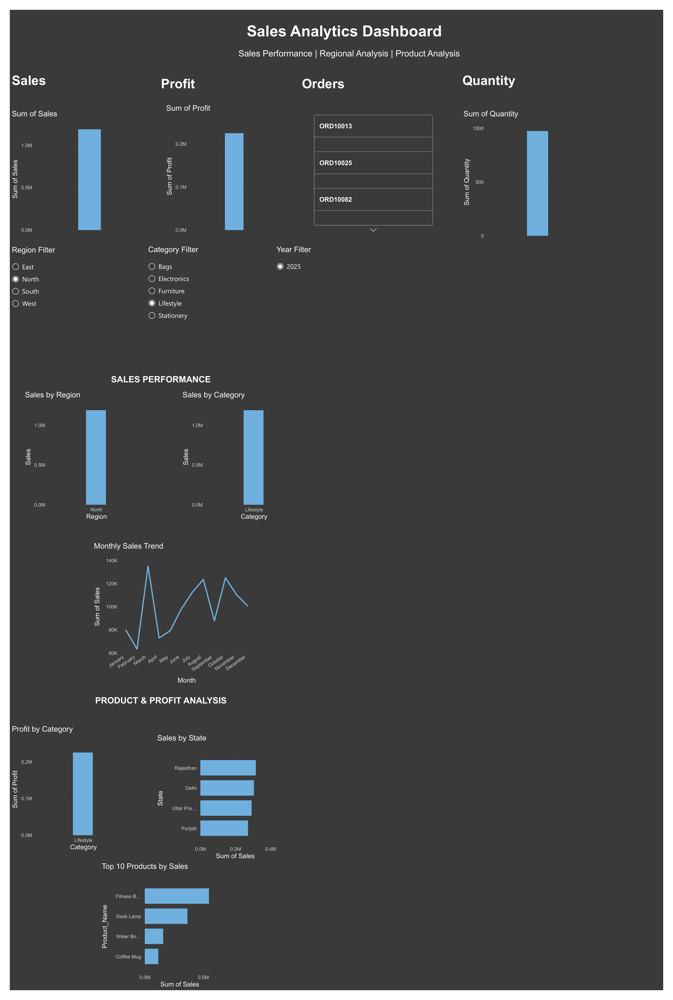
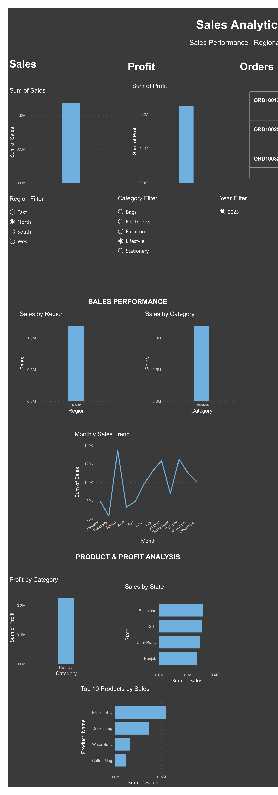
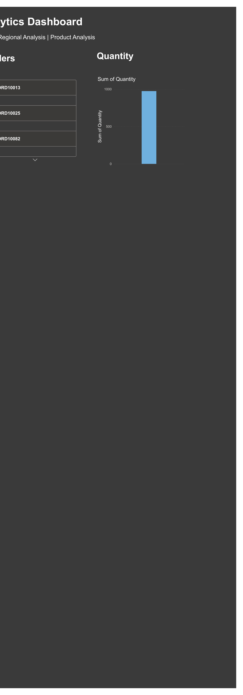

# 📊 Sales Analytics & Business Intelligence Dashboard

An end-to-end **Sales Analytics and Business Intelligence project** using **MySQL, SQL, Excel, Power Query, Power BI, and DAX** to transform raw sales data into meaningful business insights.

---

## 🎯 Project Overview

This project analyzes **13,327 sales records** to evaluate business performance and identify trends across sales, profitability, products, customers, categories, regions, and states.

The project follows an end-to-end data analytics workflow, from **data preparation and SQL analysis to Power BI data modeling, dashboard development, and business insights**.

### Analysis Areas

- Sales performance
- Profitability
- Quantity sold
- Order performance
- Regional performance
- State-level performance
- Category performance
- Product performance
- Customer performance
- Monthly sales trends
- Discount and profitability analysis

---

## 🛠️ Tools & Technologies

| Technology | Purpose |
| **MySQL**  |  Database management and SQL analysis |
| **SQL**    | Data querying and business analysis |
| **Microsoft Excel** | Data preparation and analysis |
| **Power Query** | Data cleaning and transformation |
| **Power BI** | Interactive dashboard development |
| **DAX** | KPI calculations and analytical measures |
| **Git & GitHub** | Version control and project documentation |

---

## 📂 Project Structure

```text
Sales-Analytics-Dashboard/
│
├── README.md
│
├── data/
│   ├── README.md
│   └── Sales_Data_Cleaning.csv
│
├── sql/
|   ├── README.md
│   ├── 01_basic_analysis.sql
│   ├── 02_category_analysis.sql
│   ├── 03_region_analysis.sql
│   ├── 04_product_analysis.sql
│   ├── 05_profit_analysis.sql
│   └── 06_business_insights.sql
│
├── powerbi/
│   ├── README.md
│   └── Sales_Analytics_Dashboard.pbix
│
├── screenshots/
|   ├── README.md
│   ├── dashboard_overview.png
│   ├── sales_regional_analysis.png
│   └── product_customer_analysis.png
│
└── documentation/
    └── project_documentation.md
```

---

## 🔄 Project Workflow

```text
Raw Sales Dataset
        ↓
Data Cleaning & Transformation
        ↓
Cleaned CSV Dataset
        ↓
MySQL Database
        ↓
SQL Business Analysis
        ↓
Power BI Data Modeling
        ↓
DAX Measures & KPIs
        ↓
Interactive Dashboard
        ↓
Business Insights
```

---

## 🧹 Data Preparation

The sales dataset was prepared and cleaned before analysis.

### Data Preparation Activities

- Imported the sales dataset
- Checked data quality and consistency
- Checked for missing values
- Converted order dates into the appropriate date format
- Cleaned numeric fields
- Validated sales, cost, profit, unit price, and discount values
- Prepared the cleaned dataset for MySQL
- Prepared the data for Power BI visualization

The final cleaned dataset contains **13,327 sales records**.

---

# 🗄️ SQL Analysis

SQL and MySQL were used to perform structured business analysis on the sales dataset.

The SQL analysis is organized into six modules.

### 01 — Basic Analysis

**File:** `01_basic_analysis.sql`

Includes:

- Total orders
- Total quantity
- Total sales
- Total cost
- Total profit
- Average order value
- Profit margin
- Minimum sales
- Maximum sales
- Date range

---

### 02 — Category Analysis

**File:** `02_category_analysis.sql`

Includes:

- Sales by category
- Profit by category
- Quantity by category
- Orders by category
- Category performance

---

### 03 — Regional Analysis

**File:** `03_region_analysis.sql`

Includes:

- Sales by region
- Profit by region
- Quantity by region
- Sales by state
- Regional performance

---

### 04 — Product Analysis

**File:** `04_product_analysis.sql`

Includes:

- Top products by sales
- Top products by profit
- Top products by quantity
- Product performance
- Top customers by sales

---

### 05 — Profit Analysis

**File:** `05_profit_analysis.sql`

Includes:

- Overall profit margin
- Profit by category
- Profit by region
- Cost versus sales
- Highest-profit products
- Discount analysis

---

### 06 — Business Insights

**File:** `06_business_insights.sql`

Includes:

- Monthly sales trends
- Monthly profit trends
- Sales by category
- Profit by category
- Sales by region
- Profit by region
- Sales by product
- Quantity by product
- Profit by product
- Top customers by sales

---

# 📊 Power BI Dashboard

The Power BI dashboard provides an interactive view of sales and profitability performance.

### Dashboard Features

- **Total Sales KPI**
- **Total Profit KPI**
- **Total Orders KPI**
- **Total Quantity KPI**
- Sales by Region
- Sales by Category
- Monthly Sales Trend
- Profit by Category
- Sales by State
- **Top 10 Products by Sales**
- **Region Slicer**
- **Category Slicer**
- **Year Slicer**

---

## 📸 Dashboard Preview

### Main Dashboard



### Sales & Regional Analysis



### Product & Customer Analysis



---

# 📈 Dashboard Analysis

## 💰 Sales Performance

The dashboard provides an overview of business performance using KPI cards for total sales, profit, orders, and quantity.

## 🌎 Regional Analysis

The **Sales by Region** visualization allows users to compare sales performance across different regions.

The **Region Slicer** allows users to interactively explore individual regional performance.

## 🏷️ Category Analysis

Category-level sales and profitability can be compared to evaluate category performance and identify high-performing categories.

## 📅 Monthly Sales Trend

The monthly sales trend helps analyze changes in sales performance over time and identify periods of higher or lower sales activity.

## 📦 Product Analysis

The **Top 10 Products by Sales** visualization highlights products generating the highest sales revenue.

Product performance can also be evaluated based on quantity sold and profit.

## 📍 State Analysis

State-level sales analysis helps evaluate geographic sales performance and identify important sales-contributing states.

## 📊 Profit Analysis

Profit-related KPIs and category-level profitability analysis help evaluate business performance beyond revenue.

---

# 🎛️ Interactive Filters

The dashboard contains interactive slicers for:

- **Region**
- **Category**
- **Year**

These slicers allow users to dynamically explore different segments of the dataset.

---

# 💡 Business Questions Answered

This project helps answer important business questions such as:

1. What are the total sales and profit?
2. How many orders and units were sold?
3. Which region generates the highest sales?
4. Which region generates the highest profit?
5. Which category generates the highest sales?
6. Which category generates the highest profit?
7. Which products generate the highest sales?
8. Which products generate the highest profit?
9. Which products have the highest quantity sold?
10. How does sales performance change month by month?
11. Which states generate the most sales?
12. Which customers contribute the most sales?
13. How do discounts relate to profitability?
14. Which region and category combinations perform strongly?

---

# 📌 Business Analysis Covered

The analysis covers the following business performance areas:

- Sales and profit performance
- Regional sales and profitability
- Category-level performance
- Product sales, quantity, and profitability
- Customer sales performance
- Monthly sales and profit trends
- State-level sales performance
- Discount and profitability analysis

---

# 📁 Project Files

### `data/`

Contains the cleaned sales dataset used for SQL and Power BI analysis.

```text
Sales_Data_Cleaning.csv
```

### `sql/`

Contains six structured SQL analysis files:

```text
01_basic_analysis.sql
02_category_analysis.sql
03_region_analysis.sql
04_product_analysis.sql
05_profit_analysis.sql
06_business_insights.sql
```

### `powerbi/`

Contains the Power BI dashboard:

```text
Sales_Analytics_Dashboard.pbix
```

### `screenshots/`

Contains screenshots of the Power BI dashboard for portfolio presentation.

### `documentation/`

Contains detailed project documentation and supporting information.

---

# 🚀 Key Skills Demonstrated

## Data Analysis

- Exploratory Data Analysis
- Business Analysis
- Data Cleaning
- Data Transformation
- Data Validation
- KPI Development
- Trend Analysis
- Profitability Analysis

## SQL & Database

- SQL Queries
- MySQL
- Aggregations
- Filtering
- GROUP BY
- ORDER BY
- Business-focused SQL analysis
- Data summarization

## Power BI

- Data Modeling
- Interactive Dashboards
- KPI Cards
- Slicers
- Data Visualization
- Cross-filtering
- Business Intelligence
- Dashboard Development

## Power Query & DAX

- Data Transformation
- Data Cleaning
- DAX Measures
- Calculated KPIs
- Profitability Analysis
- Business Metrics

## Portfolio & Version Control

- Git
- GitHub
- Project Documentation
- Repository Organization

---

# 📌 Project Highlights

- Analyzed **13,327 sales records**
- Performed data cleaning and transformation
- Created a structured MySQL database
- Developed six SQL analysis modules
- Created business-focused SQL queries
- Built Power BI data models
- Developed DAX measures and KPIs
- Created interactive Power BI dashboards
- Analyzed regional, state, category, product, customer, and profitability performance
- Analyzed monthly sales and profit trends
- Created dashboard screenshots for portfolio presentation
- Organized the project into a structured GitHub repository

---

# 📜 Certifications

- **Data Analytics Job Simulation** — Deloitte, Forage
- **Data Analysis with Python** — IBM Cognitive Class
- **Cyber Job Simulation** — Deloitte, Forage
- **Power BI Workshop** — OfficeMaster
- **Introduction to Prompt Engineering** — IBM, edX

---

# ⭐ Project Status

**Status:** ✅ Completed

### Completed Components

- ✅ Data cleaning and transformation
- ✅ MySQL database setup
- ✅ SQL business analysis
- ✅ Six SQL analysis files
- ✅ Power BI data modeling
- ✅ DAX measures and KPIs
- ✅ Interactive Power BI dashboard
- ✅ Regional analysis
- ✅ Category analysis
- ✅ Product analysis
- ✅ Customer analysis
- ✅ State-level analysis
- ✅ Profitability analysis
- ✅ Dashboard screenshots
- ✅ GitHub project documentation

**Project Type:** Data Analytics / Business Intelligence

**Dataset Size:** 13,327 sales records

**Tools:** SQL, MySQL, Excel, Power Query, Power BI, DAX, Git & GitHub

---

# 👤 Author

### Kammineni Venkata Manasa

**Aspiring Data Analyst**

📧 **Email:** kvenkatamanasa@gmail.com

🔗 **LinkedIn:** linkedin.com/in/kamminenivenkatamanasa

🔗 **GitHub:** github.com/kvenkatamanasa

---

## ⭐ Thank You

Thank you for visiting this project.

This project demonstrates an end-to-end **Data Analytics and Business Intelligence workflow**, from data preparation and SQL analysis to Power BI dashboard development and business insights.
````
